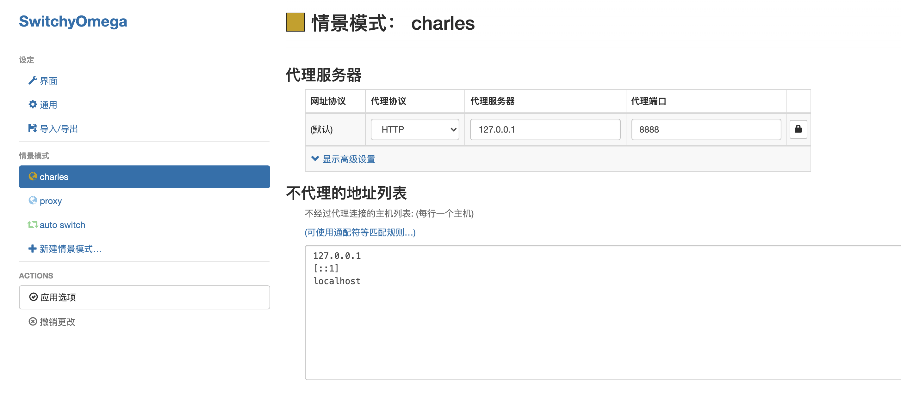

# charles 接口代理

## 作用

charles 其实是一款`代理服务器`，通过过将自己设置成系统（电脑或者浏览器）的网络访问代理服务器，然后`截取请求`和`请求结果`达到`分析抓包`的目的。

## charles 下载地址

官网： https://www.charlesproxy.com/latest-release/download.do

mac 破解版：https://xclient.info/s/charles.html#versions

windows 破解版：https://xiazai.zol.com.cn/detail/45/440045.shtml

## 谷歌浏览器插件 Proxy SwitchyOmega

> 插件下载地址

https://chrome.google.com/webstore/detail/proxy-switchyomega/padekgcemlokbadohgkifijomclgjgif?hl=zh-C

> 设置情景模式

> 启用插件后，使用 charles 模式进行代理

> 添加要代理的`网站域名`

这样就在`charles`中看到所有的接口请求了

## 功能

> 断点

在请求上选择断点

当再次请求该接口时，就会进入断点，此时可以编辑请求参数，选择取消、中断或继续执行接口。

> 修改请求结果

将请求结果保存在本地，可以进行编辑

选择`Map Local`，请求结果蒋使用本地数据

去除 `Map Local`。在 Tools > Map Local 中可以编辑所有使用本地请求结果的接口。

